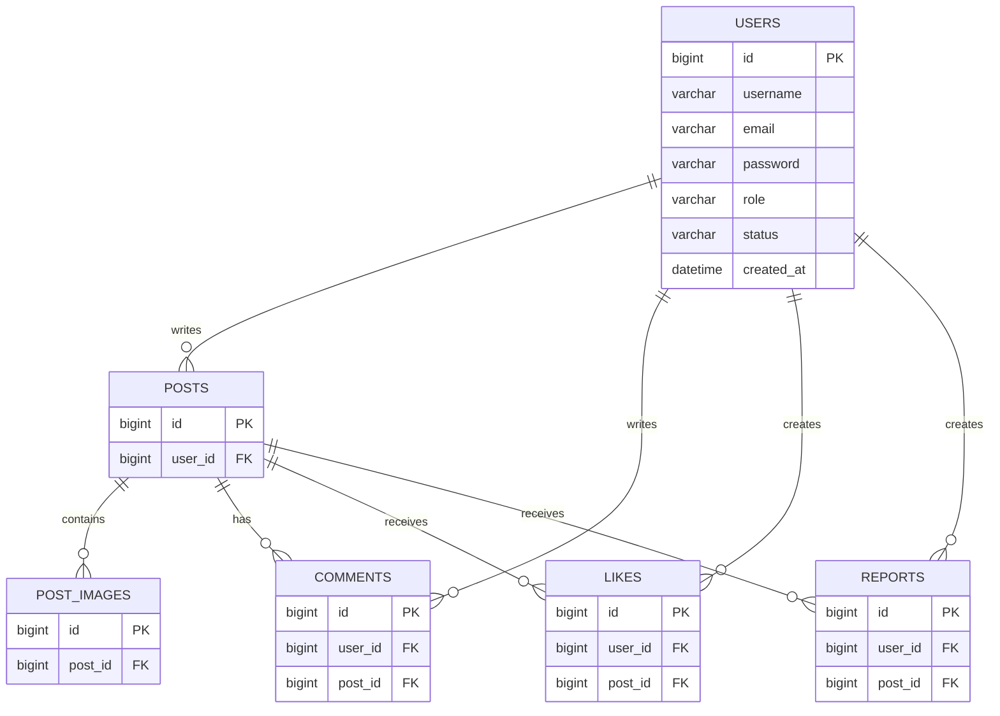

# 뽀송 (Pposong) Backend

### 일상을 기록하고 서로의 이야기를 공유하는 SNS 웹 서비스

뽀송(Pposong)은 사용자들이 일상과 사진을 공유하고, 좋아요와 댓글을 통해 소통할 수 있는 SNS 웹 서비스입니다.

Spring Boot와 MySQL을 기반으로 REST API를 구현했으며, JWT 인증과 WebSocket을 활용한 실시간 접속자 기능을 개발했습니다.

개인 포트폴리오 프로젝트로 기획부터 데이터베이스 설계, 백엔드 구현 및 AWS 서버 배포까지 진행했습니다.

## 프로젝트 링크

- **서비스:** https://pposong-frontend.vercel.app/
- **Frontend:** https://github.com/SubSou/pposong-frontend

## 기술 스택

| 구분 | 기술 |
|---|---|
| Language | Java 17 |
| Framework | Spring Boot |
| Security | Spring Security, JWT, BCrypt |
| Database | MySQL |
| ORM | Spring Data JPA |
| Build Tool | Gradle |
| Storage | AWS S3 |
| Real-time | WebSocket |
| Deployment | AWS EC2, AWS RDS, Nginx |
| Version Control | Git, GitHub |

## 주요 기능

### 회원가입 및 로그인
- 이메일 기반 회원가입 및 로그인
- BCrypt를 이용한 비밀번호 암호화
- JWT 발급 및 인증 처리
- 관리자 승인 상태에 따른 접근 제어
- 로그인 사용자 정보 조회

### 게시글
- 게시글 작성, 조회, 수정 및 삭제
- AWS S3를 이용한 이미지 업로드
- 게시글에 여러 이미지 첨부
- 작성자 권한 확인

### 좋아요 및 댓글
- 게시글 좋아요 등록 및 취소
- 댓글 작성, 조회, 수정 및 삭제
- 게시글별 좋아요 및 댓글 정보 관리

### 프로필
- 사용자 프로필 조회 및 수정
- 프로필 이미지 변경
- 사용자별 게시글 조회

### 실시간 접속자
- WebSocket을 이용한 실시간 통신
- JWT를 통한 접속 사용자 식별
- 접속 및 연결 종료 시 사용자 목록 갱신
- 현재 접속 중인 사용자 정보 전달

### 게시글 신고
- 게시글 신고 접수
- 신고 사유 및 신고 내역 관리

## 데이터베이스 설계 (ERD)

MySQL과 JPA를 사용해 사용자, 게시글, 댓글, 좋아요 등의 데이터를 관리하도록 구성했습니다.

사용자와 게시글을 중심으로 각 테이블을 연결했습니다.



※ 현재 ERD는 주요 엔티티의 관계를 정리한 초안입니다. 실제 데이터베이스의 컬럼과 외래 키는 최종 확인이 필요합니다.

### 테이블 설명

| 테이블 | 설명 |
|---|---|
| `users` | 회원 정보 및 승인 상태 |
| `posts` | 게시글 정보 |
| `post_images` | 게시글 이미지 |
| `comments` | 게시글 댓글 |
| `likes` | 게시글 좋아요 |
| `reports` | 게시글 신고 |

## 프로젝트 구조

```text
src/main/java/com/pposong/pposongbackend/
├── config/         # Security, S3, WebSocket 설정
├── controller/     # API 요청 처리
├── dto/            # 요청 및 응답 데이터
├── entity/         # JPA 엔티티
├── exception/      # 예외 처리
├── jwt/            # JWT 생성 및 검증
├── repository/     # 데이터베이스 접근
├── service/        # 비즈니스 로직
└── websocket/      # 실시간 접속자 관리
```

Controller, Service, Repository 계층을 분리하고, API 요청과 응답에는 DTO를 사용했습니다.

## 주요 API

| Method | Endpoint | 설명 |
|---|---|---|
| POST | `/api/auth/signup` | 회원가입 |
| POST | `/api/auth/login` | 로그인 |
| GET | `/api/auth/me` | 로그인 사용자 조회 |
| GET | `/api/posts` | 게시글 목록 조회 |
| POST | `/api/posts` | 게시글 작성 |
| GET | `/api/posts/{postId}` | 게시글 상세 조회 |
| DELETE | `/api/posts/{postId}` | 게시글 삭제 |

댓글, 좋아요, 프로필, 신고 및 이미지 업로드 API도 별도로 구현했습니다.

## 인증 처리

Spring Security와 JWT를 사용해 로그인 및 인증 기능을 구현했습니다.

1. 사용자가 이메일과 비밀번호로 로그인 요청
2. DB에서 사용자 정보 조회
3. 비밀번호 및 관리자 승인 상태 확인
4. 인증에 성공하면 JWT 발급
5. 이후 API 요청 시 JWT를 전달
6. JWT 필터에서 토큰을 검증한 후 요청 처리

비밀번호는 BCrypt로 암호화해 저장하고, 승인된 사용자만 인증된 기능에 접근할 수 있도록 구성했습니다.

## 배포 환경

프론트엔드는 Vercel, 백엔드는 AWS EC2에 배포했습니다.

| 구분 | 환경 |
|---|---|
| Frontend | Vercel |
| Backend | AWS EC2 (Ubuntu) |
| Database | AWS RDS (MySQL) |
| Image Storage | AWS S3 |
| Web Server | Nginx |
| HTTPS | Let's Encrypt |
| Process | systemd |

EC2에서 Spring Boot 애플리케이션을 실행하고 Nginx를 Reverse Proxy로 사용했습니다.

데이터베이스는 RDS로 분리했으며, 게시글과 프로필 이미지는 S3에 저장하도록 구성했습니다.

## 개발하면서 해결한 문제

### CORS 오류

프론트엔드를 Vercel에 배포한 후 API 요청이 차단되는 문제가 있었습니다.

Spring Security의 CORS 설정에 배포된 프론트엔드 주소를 추가하고, 요청이 정상적으로 처리되도록 수정했습니다.

### 이미지 업로드 오류

이미지 업로드 과정에서 `413 Request Entity Too Large` 오류가 발생했습니다.

Nginx의 업로드 요청 크기 제한을 확인하고 `client_max_body_size` 설정을 조정했습니다.

### WebSocket 연결 오류

로컬에서는 정상적으로 연결되던 WebSocket이 배포 환경에서 연결되지 않는 문제가 있었습니다.

HTTPS 환경에 맞게 WSS를 적용하고, Nginx의 WebSocket 관련 헤더와 서버의 허용 Origin 설정을 수정했습니다.
